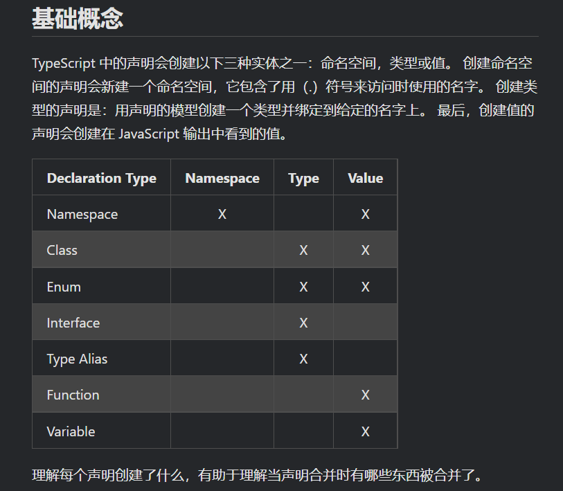

```ts
在构造函数的参数上使用 public 等同于创建了同名的成员变量。

redux的ts规范用法
https://bosens-china.github.io/Typescript-manual/download/zh/tutorials/react.html#%E6%B7%BB%E5%8A%A0state%E7%AE%A1%E7%90%86


JS迁移到ts
由模块导入
你可能会看到一些类似 Cannot find name 'require'. 和 Cannot find name 'define'. 的错误。 遇到这种情况说明你在使用模块。 你仅需要告诉 TypeScript 它们是存在的：
// For Node/CommonJS
declare function require(path: string): any;

// For RequireJS/AMD
declare function define(...args: any[]): any;

获取声明文件
你可能会遇到 Cannot find module 'foo'
这样的错误
问题出在没有_声明文件_来描述你的代码库。
npm install -S @types/lodash
如果你没有使用 commonjs 模块模块选项，那么就需要将 moduleResolution 选项设置为 node 。

any ， Object ，和 {}
如果你还是决定使用 Object 和 {} ，你应该选择 {}作为类型（plain object）

我们应该使用 number 、 string 、 boolean 、 object 和 symbol
小写作为类型

类是具有两个类型的：静态部分的类型和实例的类型。
接口描述了类的公共部分，而不是公共和私有两部分。 它不会帮你检查类是否具有某些私有成员，并且只对其实例部分进行类型检查。
constructor 存在于类的静态部分，所以不在检查的范围内。

当你在 TypeScript 里声明了一个类的时候，实际上同时声明了很多东西。 首先就是类的_实例_的类型。

泛型约束:对象上面必须要**有**某个属性：使用extends接口

有点像python
在 TypeScript 4.2 中，剩余元素会按它们的使用方式进行展开。 在之前的版本中，TypeScript 只允许 ...rest 元素位于元组的末尾。
唯一的限制是，剩余元素之后不能出现可选元素或其它剩余元素。 换句话说，一个元组中只允许有一个剩余元素，并且剩余元素之后不能有可选元素。

git恢复数据
三种情况1.未add未commit 2.add了未commit 3.已add已commit=>git reflog命令


```
