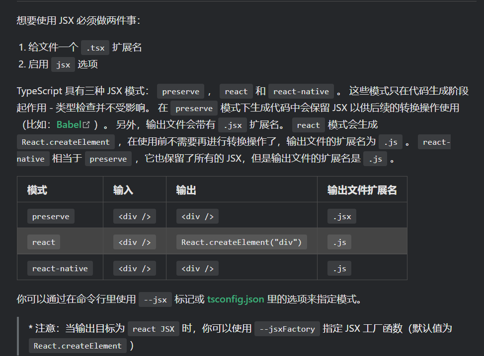
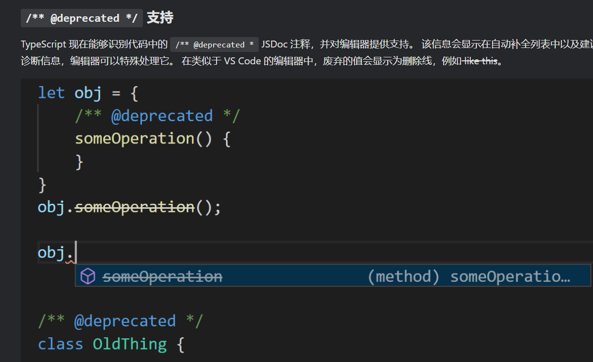

```ts
在构造函数的参数上使用 public 等同于创建了同名的成员变量。

redux的ts规范用法
https://bosens-china.github.io/Typescript-manual/download/zh/tutorials/react.html#%E6%B7%BB%E5%8A%A0state%E7%AE%A1%E7%90%86


JS迁移到ts
由模块导入
你可能会看到一些类似 Cannot find name 'require'. 和 Cannot find name 'define'. 的错误。 遇到这种情况说明你在使用模块。 你仅需要告诉 TypeScript 它们是存在的：
// For Node/CommonJS
declare function require(path: string): any;

// For RequireJS/AMD
declare function define(...args: any[]): any;

获取声明文件
你可能会遇到 Cannot find module 'foo'
这样的错误
问题出在没有_声明文件_来描述你的代码库。
npm install -S @types/lodash
如果你没有使用 commonjs 模块模块选项，那么就需要将 moduleResolution 选项设置为 node 。

any ， Object ，和 {}
如果你还是决定使用 Object 和 {} ，你应该选择 {}作为类型（plain object）

我们应该使用 number 、 string 、 boolean 、 object 和 symbol
小写作为类型

类是具有两个类型的：静态部分的类型和实例的类型。
接口描述了类的公共部分，而不是公共和私有两部分。 它不会帮你检查类是否具有某些私有成员，并且只对其实例部分进行类型检查。
constructor 存在于类的静态部分，所以不在检查的范围内。

当你在 TypeScript 里声明了一个类的时候，实际上同时声明了很多东西。 首先就是类的_实例_的类型。

泛型约束:对象上面必须要**有**某个属性：使用extends接口

有点像python
在 TypeScript 4.2 中，剩余元素会按它们的使用方式进行展开。 在之前的版本中，TypeScript 只允许 ...rest 元素位于元组的末尾。
唯一的限制是，剩余元素之后不能出现可选元素或其它剩余元素。 换句话说，一个元组中只允许有一个剩余元素，并且剩余元素之后不能有可选元素。

git恢复数据
三种情况1.未add未commit 2.add了未commit 3.已add已commit=>git reflog命令


TypeScript 具有三种 JSX 模式： preserve ， react 和 react-native


对象展开还有其它一些意想不到的限制。 它仅包含对象**实例** 自身的可枚举属性.
class C {
  p = 12;
  m() {
  }
}
let c = new C();
let clone = { ...c };
clone.p; // ok
clone.m(); // error!

tsconfig.json

tsconfig.json
#概述
通过 tsconfig.json 指示一个项目
通过添加 tsconfig.json 到一个目录指明这是一个 TypeScript 项目的根目录. tsconfig.json 文件指定了根文件以及编译项目需要的编译器选项。一个项目可以由以下方式编译:
调用 tsc 并不指定输入文件，此时编译器会从当前目录开始往上级目录寻找 tsconfig.json 文件.
调用 tsc 并不指定输入文件，使用 -project (或者 -p ) 命令行选项指定包含了 tsconfig.json 文件的目录.

#例子
使用 "files" 属性
{
    "compilerOptions": {
        "module": "commonjs",
        "noImplicitAny": true,
        "removeComments": true,
        "preserveConstEnums": true,
        "sourceMap": true
    },
    "files": [
        "core.ts",
        "sys.ts",
        "types.ts",
        "scanner.ts",
        "parser.ts",
        "utilities.ts",
        "binder.ts",
        "checker.ts",
        "emitter.ts",
        "program.ts",
        "commandLineParser.ts",
        "tsc.ts",
        "diagnosticInformationMap.generated.ts"
    ]
}
{
    "compilerOptions": {
        "module": "system",
        "noImplicitAny": true,
        "removeComments": true,
        "preserveConstEnums": true,
        "outFile": "../../built/local/tsc.js",
        "sourceMap": true
    },
    "include": [
        "src/**/*"
    ],
    "exclude": [
        "node_modules",
        "**/*.spec.ts"
    ]
}
默认所有_可见的_" @types " 包会在编译过程中被包含进来。
也就是说， ./node_modules/@types/ ， ../node_modules/@types/ 和 ../../node_modules/@types/ 等等。
指定 "types": [] 来禁用自动引入 @types 包。
使用 extends 继承配置


编码规范
命名
- 使用 PascalCase 为类型命名。
- 不要使用 I 做为接口名前缀。
- 使用 PascalCase 为枚举值命名。
- 使用 camelCase 为函数命名。
- 使用 camelCase 为属性或本地变量命名。
- 不要为私有属性名添加 _ 前缀。
- 尽可能使用完整的单词拼写命名。
组件
- 1 个文件对应一个逻辑组件 （比如：解析器，检查器）。
- 不要添加新的文件。 😃
- .generated.* 后缀的文件是自动生成的，不要手动改它
类型
- 不要导出类型 / 函数，除非你要在不同的组件中共享它。
- 不要在全局命名空间内定义类型 / 值。
- 共享的类型应该在 types.ts 里定义。
- 在一个文件里，类型定义应该出现在顶部。
使用 undefined，不要使用 null
为了保持一致，在核心编译链中不要使用类，使用函数闭包代替。
风格
为函数，接口，枚举类型和类使用 JSDoc 风格的注释。
使用 arrow 函数代替匿名函数表达式。
只要需要的时候才把 arrow 函数的参数括起来。 比如， (x) => x + x 是错误的，下面是正确的做法：
x => x + x
(x,y) => x + y
<T>(x: T, y: T) => x === y
总是使用 {} 把循环体和条件语句括起来。
开始的 { 总是在同一行。
小括号里开始不要有空白。逗号，冒号，分号后要有一个空格。比如：
for (var i = 0, n = str.length; i < 10; i++) { }
if (x < 10) { }
function f(x: number, y: string): void { }
每个变量声明语句只声明一个变量 （比如 使用 var x = 1; var y = 2; 而不是 var x = 1, y = 2; ）。
else 要在结束的 } 后另起一行。


ts一些更新
1.8
Case 语句贯穿
TypeScript 现在可以在 switch 语句中出现贯穿的几个非空 case 时报错。这个检测默认是关闭的，可以使用 --noFallthroughCasesInSwitch 启用.
switch (x % 2) {
    case 0: // 错误: switch 中出现了贯穿的 case.
        console.log("even");

    case 1:
        console.log("odd");
        break;
}
在模块中扩充全局或者模块作用域
模块扩充的形式和过去的包模块一致 (例如 declare module "foo" { } 这样的语法), 并且可以直接嵌在你自己的模块内，或者在另外的顶级外部包模块中.
除此之外，TypeScript 还以 declare global { } 的形式提供了对于_全局_声明的扩充。这能使模块对像 Array 这样的全局类型在必要的时候进行扩充.


2.0
指定函数中 this 类型
紧跟着类和接口，现在函数和方法也可以声明 this 的类型了。
函数中 this 的默认类型是 any 。从 TypeScript 2.0 开始，你可以提供一个明确的 this 参数。 this 参数是伪参数，它位于函数参数列表的第一位：
function f(this: void) {
    // 确保`this`在这个独立的函数中无法使用
}

只有 get 而没有 set 的存取器会被自动推断为 readonly 属性

使用 --lib 编译参数包含内置类型声明
获取 ES6/ES2015 内置 API 声明仅限于 target: ES6 。输入 --lib ，你可以使用 --lib 指定一组项目所需要的内置 API。比如说，如果你希望项目运行时支持 Map 、 Set 和 Promise （例如现在静默更新浏览器），直接写 --lib es2015.collection,es2015.promise 就好了。同样，你也可以排除项目中不需要的声明，例如在 node 项目中使用 --lib es5,es6 排除 DOM。

支持编译参数 target : es5 和 module: es6 同时使用
之前编译参数 target : es5 和 module: es6 同时使用被认为是无效的，但是现在是有效的。这将有助于使用基于 ES2015 的 tree-shaking（将无用代码移除）比如 rollup。


支持 --target ES2016 , --target ES2017 和 --target ESNext
TypeScript 2.1 支持三个新的编译版本值 --target ES2016 , --target ES2017 和 --target ESNext 。
使用 target --target ES2016 将指示编译器不要编译 ES2016 特有的特性，比如 ** 操作符。
同样， --target ES2017 将指示编译器不要编译 ES2017 特有的特性像 async/await 。
--target ESNext 则对应最新的 ES 提议特性支持


2.7
元组现在具有固定长度的属性
in 表达式被视为类型保护

2.8
改进对映射类型修饰符的控制
映射类型里的 readonly 或 ? 属性修饰符现在可以使用 + 或 - 前缀，来表示修饰符是添加还是移除。
type MutableRequired<T> = { -readonly [P in keyof T]-?: T[P] };  // 移除readonly和?
type ReadonlyPartial<T> = { +readonly [P in keyof T]+?: T[P] };  // 添加readonly和?

2.9
keyof 现在包括 string 、 number 和 symbol 键名
如果你的函数只能处理名字符串属性的键，请在声明中使用 Extract<keyof T，string>
function useKey<T, K extends Extract<keyof T, string>>(o: T, k: K) {
  var name: string = k;  // OK
}
如果你的函数可以处理所有属性键，那么更改应该是顺畅的：
function useKey<T, K extends keyof T>(o: T, k: K) {
  var name: string | number | symbol = k;
}

3.4
const 断言
当我们用 const 断言构造新的字面量表达式时，我们可以用来表示：

该表达式中的字面量类型不应粗化（例如，不要从 'hello' 到 string ）
对象字面量获得 readonly 属性
数组字面量成为 readonly 元组
// Type '"hello"'
let x = "hello" as const;

// Type 'readonly [10, 20]'
let y = [10, 20] as const;

// Type '{ readonly text: "hello" }'
let z = { text: "hello" } as const;

3.8
类型导入和导出（Type-Only Imports and Exports）
import type { SomeThing } from "./some-module.js";
export type { SomeThing };
顶层 await（Top-Level await）

4.0
可变参元组类型
剩余元素可以出现在元组中的任意位置上 - 不只是末尾位置！

/** @deprecated */ 支持
TypeScript 现在能够识别代码中的 /** @deprecated * JSDoc 注释，并对编辑器提供支持。 该信息会显示在自动补全列表中以及建议诊断信息，编辑器可以特殊处理它。 在类似于 VS Code 的编辑器中，废弃的值会显示为删除线，例如 like this。


4.1
模版字面量类型

4.2
解构出来的变量可以_被明确地标记为未使用的
声明缺失的函数
TypeScript 支持了一个新的快速修复功能，那就是根据调用方来生成新的函数和方法声明！
```
