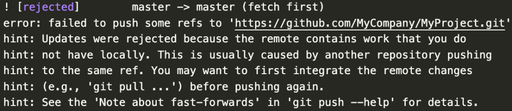
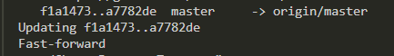

## You have divergent branches and need to specify how to reconsile them 问题

[我该如何处理这个 Git 警告](https://stackoverflow.com/questions/62653114/how-can-i-deal-with-this-git-warning-pulling-without-specifying-how-to-reconci)
[错误现场](https://jumping-code.com/2022/06/09/solution-git-divergent-branches/)
[ merge 和 rebase 图例](https://stackoverflow.com/questions/16666089/whats-the-difference-between-git-merge-and-git-rebase)
[rebase 三步：rollback、fast-forward、replay](https://stackoverflow.com/questions/62659379/difference-between-git-pull-rebase-autostash-and-git-pull-ff-only)
[fast-forward 只是移动指针](https://stackoverflow.com/questions/25430600/difference-between-git-pull-rebase-and-git-pull-ff-only)
[何时需要强制推送](https://stackoverflow.com/questions/43567577/what-is-the-difference-between-force-push-and-normal-push-in-git)
[如何修改现有的、未推送的提交消息？](https://)

```bash
warning: Pulling without specifying how to reconcile divergent branches is
discouraged. You can squelch this message by running one of the following
commands sometime before your next pull:

  git config pull.rebase false  # merge (the default strategy)
  git config pull.rebase true   # rebase
  git config pull.ff only       # fast-forward only

You can replace "git config" with "git config --global" to set a default
preference for all repositories. You can also pass --rebase, --no-rebase,
or --ff-only on the command line to override the configured default per
invocation.
```

1. 是什么
   **其他人使用 branch 并 push 到公共分支，公共分支版本比我的新，导致我 commit 后想要 push 时出错(被打回)**
   
   这种报错比较少，因为 push 之前正常都会拉代码。
   **但这时 pull 時发生另一个错误：Need to specify how to reconcile divergent branches.**
   查看 git status，git 会提示我的分支有分歧的问题。
2. 为什么
   本地和远端代码出现了分歧`(lca(a,b)!=a!=b)`，git 需要解决协同冲突，但 git pull 没有设置合并策略。
3. 怎么办

   1. git config 设置仓库或者全局的默认合并策略

      - git config pull.rebase false # merge (the default strategy) ：`merge 作为合并`
      - git config pull.rebase true # rebase ：`rebase 作为合并`
      - 还有一种是 git config pull.ff only # fast-forward only ：
        `快进式合并，没有分歧，直接移动头指针`
        例如:
        远端 A-B-C-D-E，本地 A-B-C，git pull --ff-only 后 fast-forward 变成 A-B-C-D-E
        
        如果本地和远程分支存在分歧(diverged)，无法通过快进解决它们， git pull --ff-only 会失败

   2. 我就是不想设置默认合并策略，我想每次 pull 时都手动选择合并策略
      一样的
      `pull --no-rebase = fetch + merge，对应 git config pull.rebase false`
      `pull --rebase = fetch + rebase，对应 git config pull.rebase true`
      `pull --ff-only = fetch + merge --ff-only，对应 git config pull.ff only`

   3. 解决冲突
      - merge 策略，手动解决冲突后，需要再次 commit，产生一个**合并提交**
        远端 A-B-C 与本地 A-B-D merge 后变成 A-B-D-E，产生一个合并提交 E
        2~%}68L57Q2~SM52LZYQ.png>)
      - rebase 策略，手动解决冲突后，需要 git rebase --continue 直到无冲突为止，不需要再次 commit，但会`更新`本地的提交
        远端 A-B-C 与本地 A-B-D rebase 后变成 A-B-C-D'，不会产生合并提交
        https://www.aslinwang.com/2019/06/git-rebase/

4. 题外话：git 哪些情况需要强推`(git push -f)`
   仅当需要将远程历史记录覆盖为本地历史记录时，才强制推送
   重写本地历史记录，就会发生这种情况。
   例如:
   git reset HEAD^
   git rebase
   git commit --amend：修改最近的提交消息
5. git push --force-with-lease 是什么
   它会检查其他人是否已将更改推送到分支。
   **如果远程存储库上的分支没有分歧（即，其他人没有推送新的提交），则将允许您的推送。**
   如果其他人推送了更改，则推送将被拒绝，确保您不会意外覆盖其他人的工作。

6. 修改提交信息
   1. 修改顶部：git commit --amend -m "your new message"
      如果已经提交到了远程分支，需要 git push --force-with-lease
   2. 修改过去若干次：交互式变基
      git rebase -i HEAD~n
      https://blog.csdn.net/weixin_43459866/article/details/112799099
