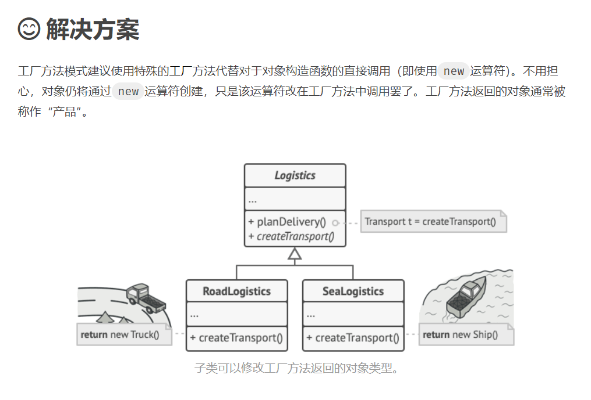

假设你正在开发一款物流管理应用。 最初版本只能处理卡车运输， 因此大部分代码都在位于名为 卡车的类中。

一段时间后， 这款应用变得极受欢迎。 你每天都能收到十几次来自海运公司的请求， 希望应用能够支持海上物流功能。
这可是个好消息。 但是代码问题该如何处理呢？ 目前， 大部分代码都与 卡车类相关。 在程序中添加 轮船类需要修改全部代码。 更糟糕的是， 如果你以后需要在程序中支持另外一种运输方式， 很可能需要再次对这些代码进行大幅修改。

最后， 你将不得不编写繁复的代码， 根据不同的运输对象类， 在应用中进行不同的处理。

解决方案
工厂方法模式建议使用特殊的工厂方法代替对于对象构造函数的直接调用 （即使用 new 运算符）。 不用担心， 对象仍将通过 new 运算符创建， 只是该运算符改在工厂方法中调用罢了。 工厂方法返回的对象通常被称作 “产品”。

