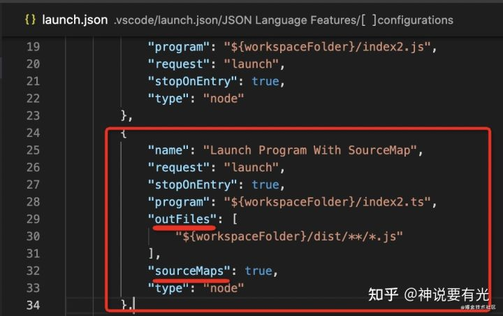

运行 nodejs 代码的时候，如果带上了 --inspect（可以打断点） 或者 --inspect-brk（可以打断点，并在首行断住） 的参数，那么就会以 debugger 的模式启动

调试 ts 代码，肯定不能调试编译后的代码，要能够映射回源码，这个是 `sourcemap` 做的事情

nodejs debugger 的原理是 `js 引擎会启动 debugger server（websocket），等待客户端连接`，我们可以通过各种 debugger client 连上来进行调试，比如 chrome devtools、vscode debugger。

vscode debugger 的使用主要是在 .vscode/launch.json 里面添加调试配置。
调试配置分为 launch 和 attach 两种：
launch 会`启动 debugger server` 并用 debugger client 连接上
attach 只是`启动 debugger client` 连接上已有的 debugger server，所以要指定端口
