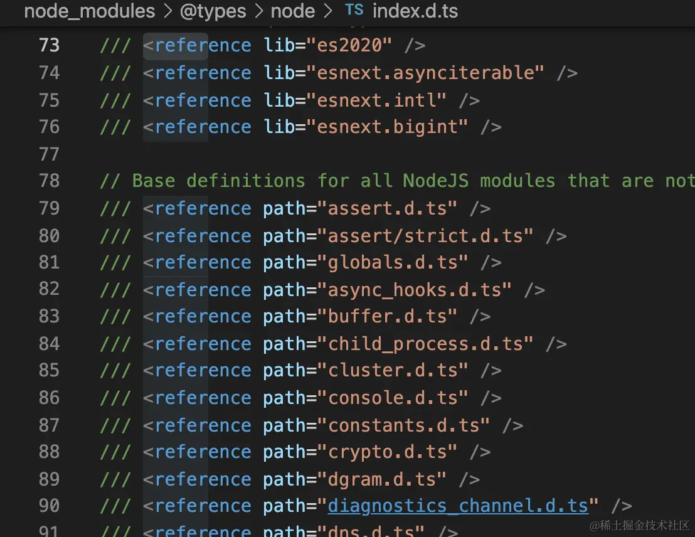

TypeScript 类型体操通关秘籍
https://juejin.cn/book/7047524421182947366/section/7048460240966123559?utm_source=profile_book

1. 类型检查可以在运行时做，也可以运行之前的编译期做。这是两种不同的类型，前者叫做动态类型检查，后者叫做静态类型检查。
   两种类型检查各有优缺点。

   - 动态类型检查 在源码中不保留类型信息，对某个变量赋什么值、做什么操作都是允许的，写代码很灵活。但这也埋下了类型不安全的隐患，比如对 string 做了乘除，对 Date 对象调用了 exec 方法，这些都是运行时才能检查出来的错误。其中，最常见的错误应该是 “null is not an object”、“undefined is not a function” 之类的了，写代码时没发现类型不匹配，到了运行的时候才发现，就会有很多这种报错。
   - 静态类型检查则是在源码中保留类型信息，声明变量要指定类型，对变量做的操作要和类型匹配，会有专门的编译器在编译期间做检查。

2. 这里的 & string 可能大家会迷惑，解释一下：

因为索引类型（对象、class 等）可以用 string、number 和 symbol 作为 key，这里 keyof T 取出的索引就是 string | number | symbol 的联合类型，和 string 取交叉部分就只剩下 string 了。就像前面所说，`交叉类型会把同一类型做合并，不同类型舍弃`。
**可以理解为推断过程中的 as**

3. 顺口溜

- 提取：模式匹配做提取
- 变换：重新构造做变换
- 循环：递归复用做循环
  你会想到 Map/reduce 函数，但是不支持传函数，所以每种 map/reduce 都会写具体的功能，
  比如 MapEntry，ReduceCount 等
- 计数：数组长度做计数
- 简化：联合分散可简化
  联合类型遵从分配律
  type T<{ a: string } | { b: number }> 实际上等价于 type T<{ a: string }> | type T<{ b: number }>。

1. ParseQueryString
   a=1&b=2&c=3&d=4，这样的字符串明显是 query param 个数不确定的，遇到数量不确定的问题，条件反射的就要想到递归：

2. Promise.all 数组的类型约束为什么是 unknown[] | []

```ts
interface PromiseConstructor {
  all<T extends readonly unknown[] | []>(
    values: T
  ): Promise<{
    -readonly [P in keyof T]: Awaited<T[P]>
  }>
}
```

**约束为 unknown[] | [] 就是 as const 的意思。**


3. js 与 ts 对应

变量 => type / interface
局部变量 => infer
条件 => extends
循环 => 递归
函数 => (...args: any[]) => any
对象 => Record
数组 => 元组

4. variant(型变)
   https://juejin.cn/book/7047524421182947366/section/7087183755504255016?utm_source=profile_book
   “型变”分为两种，
   一种是子类型可以赋值给父类型，叫做`协变`（covariant），
   一种是父类型可以赋值给子类型，叫做`逆变`（contravariant）。

   ts2.x 之前父类型可以赋值给子类型，子类型可以赋值给父类型，既逆变又协变，叫做“`双向协变`”。
   但是这明显是有问题的，不能保证类型安全，所以之后 ts 加了一个编译选项 **strictFunctionTypes**，设置为 true 就**只支持函数参数的逆变**，设置为 false 则是双向协变。
   参数的位置是逆变的，也就是被赋值的函数参数要是赋值的函数参数的子类型，而 string 不是 'hello' 的子类型，所以报错了。
   返回值的位置是协变的，也就是赋值的函数的返回值是被赋值的函数的返回值的子类型，这里 undefined 是 void 的子类型，所以不报错。

   非父子类型之间不会发生型变，只要类型不一样就会报错.这种叫做`不变`（invariant）。

5. 类型父子关系的判断
   java 里面的类型都是通过 extends 继承的，如果 A extends B，那 A 就是 B 的子类型。这种叫做`名义类型系统（nominal type）`。
   而 ts 里不看这个，只要结构上是一致的，那么就可以确定父子关系，这种叫做`结构类型系统（structual type）`。
   那是怎么确定父子关系的？
   通过结构，更**具体**的那个是子类型。
   注意，这里用的是更具体，**而不是更多**。
   判断联合类型父子关系的时候， 'a' | 'b' 和 'a' | 'b' | 'c' 哪个更具体？
   `'a' | 'b' 更具体，所以 'a' | 'b' 是 'a' | 'b' | 'c' 的子类型。`
   
6. babel 与 tsc 编译 ts
   babel 和 tsc 编译 ts 代码的区别：babel 不会做类型检查，但是在代码产物上更有优势，可以根据 targets 指定的环境来按需编译并且引入 polyfill。而 tsc 只能指定语言版本的 target，不会做 polyfill，代码产物会更大一些，但是类型检查必须依赖它。
   两者结合的方式就是用 babel（或者 swc、esbuild 等同类编译器）来编译 ts 代码，然后用 tsc --noEmit 执行类型检查。
7. 三种类型来源 与 三种模块语法

   TypeScript 给 JavaScript 添加了类型信息，在编译时做类型检查。
   除了在变量声明时定义类型外，TS 也支持通过 declare 单独声明类型。只存放类型声明的文件后缀是 d.ts。

   1. TypeScript 有三种存放类型声明的地方：
      tsc 在编译的时候，会分别加载 lib 的，@types 下的，还有 include 和 files 的文件，进行类型检查。

   - lib： 内置的类型声明，包含 dom 和 es 的，因为这俩都是有标准的。
     
   - @types/xx： 其他环境的 api 类型声明，比如 node，还有 npm 包的类型声明
     
     
     TS 会先加载内置的 lib 的类型声明，然后再去查找 @types 包下的类型声明。
     @types 包是在 DefinitelyTyped 这个项目下统一管理的，想创建一个 @types 包的话要去看一下他们的文档。
     可以指定加载 @types 目录下的哪些包，还可以修改查找 @types 包的目录（默认是 node_modules/@types)：
     
   - 开发者写的代码：通过 include + exclude 还有 files 指定
     
     其中，npm 包也可以同时存放 ts 类型，通过 `packages.json 的 types 字段`指定路径即可。
     vue3 不需要 @types/vue 包，因为本身是用 ts 写的，npm 包里也包含了 dts 文件。
     但是 react 不是 ts 写的，是用的 facebook 自己的 flow，自然就需要 @types/react 的包来加上 ts 类型声明。
     > include 和 files 的主要区别在于，include 支持 glob 模式，可以更方便地包含一个目录下的所有文件，而 files 则需要精确地指定每一个需要包含的文件。

   2. 巧合的是，TS 声明模块的方式也是三种：

   - namespace：最早的实现模块的方式，编译为声明对象和设置对象的属性的 JS 代码，很容易理解
     
   - module：和 namespace 的 AST 没有任何区别，只不过一般用来声明 CommonJS 的模块，在 @types/node 下有很多
     
     > module 和 namespace 有什么区别呢？
     > 其实真没什么区别，只不过 module 后一般接一个`路径`，而 namespace 后一般是一个`命名空间名字`。其他的语法都一样的。
     > 用 astexplorer.net 看一下 parse 后的 AST，两者的 AST 类型都是一样的。也就是说编译器后续的处理都一样，那不是一种东西是什么。
   - es module：es 标准的模块语法，ts 额外扩展了 import type
     dts 的类型声明默认是全局的，除非有 es module 的 import、export 的声明，这时候就要手动 declare global 了。
     为了避免这种情况，可以用 `reference` 的编译器指令(需要引入模块，但是也需要全局声明类型)。
     
     现在声明模块不咋推荐用 namespace 和 module，还是尽量用 es module 吧。

8. project reference 加速 tsc 编译
   
   
   TypeScript 3.0 时实现了 Project Reference 来优化性能。
   如果项目下有一些相对独立的模块，别的模块的变动不影响它，但是它却要跟着重新编译一次，这时就可以用 Project Reference 来优化了。
   在独立的模块下添加 tsconfig.json，加上 composite 的编译选项，在入口的 tsconfig.json 里配置 references 引用这些独立的模块。然后执行 tsc --build 或者 tsc -b 来编译。
   这时候就实现了编译和类型检查的性能优化。
   原理是编译时会生成 tsconfig.tsbuildinfo 的文件，记录着编译的文件和它们的 hash，当再次编译的时候，`如果文件 hash 没变，那就直接跳过`，从而提升了编译速度。
   这是 TypeScript 提供的编译性能优化机制，当项目比较大，tsc 执行的速度比较慢的时候，不妨尝试一下。

   Project Reference 是 TypeScript 3.0 引入的一个新特性，它允许我们将大型代码库分割成较小、更易于管理的模块。当你在一个 TypeScript 项目中引用另一个 TypeScript 项目时，就创建了一个 Project Reference。

   使用 Project Reference 有以下几个优点：

   1. **增量编译**：TypeScript 只会重新编译改变了的项目，而不是整个代码库，这可以大大提高编译速度。
   2. **项目结构**：Project Reference 可以更好地组织你的代码。你可以将代码库分割成多个小项目，每个项目都有自己的责任和依赖。
   3. **更好的编辑器支持**：使用 Project Reference，编辑器可以更准确地推断出类型和提供 IntelliSense。

   在 `tsconfig.json` 文件中，你可以使用 `references` 选项来指定项目引用，例如：

   ```json
   {
     "compilerOptions": {
       // ...
     },
     "references": [{ "path": "../core" }, { "path": "../utils" }]
   }
   ```

   在这个例子中，当前项目引用了 `core` 和 `utils` 两个项目。
