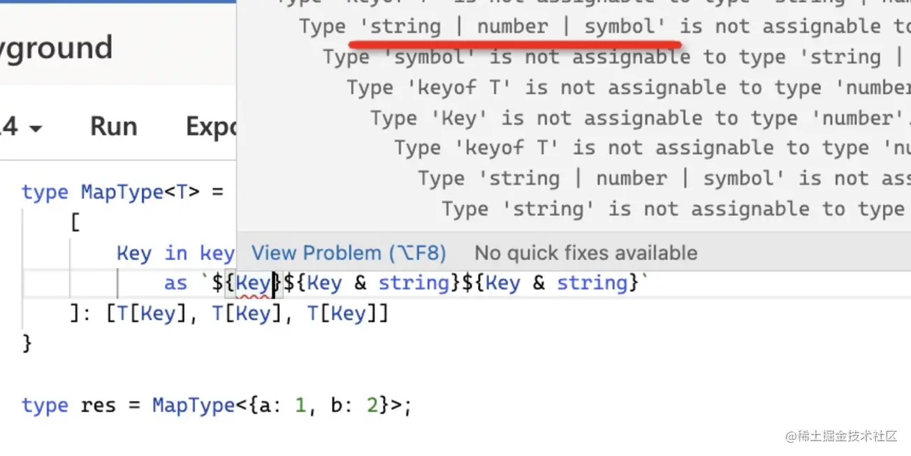
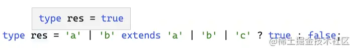

1. 交叉类型（Intersection）类似 js 中的与运算符 &，但是作用于类型，代表对类型做合并。
   注意，同一类型可以合并，`不同的类型没法合并，会被舍弃：`
   **& string**
   
   keyof 默认取出来的是 string | symbol | number， 和 string 取交叉类型就只剩下 string 部分了

2. Func 类型的参数定义写 `...args: any[]`

注意，这里不能用 unknown，**因为参数类型是要赋值给别的类型的，而 unknown 只能用来接收类型，所以用 any**

```TS
(...args: any[]) => unknown
```

3. `构造器`和函数的区别是，构造器是用于创建对象的，所以可以被 new。
4. ts 只有类型被用到的时候才会做类型计算
   所以可以在前面加上一段 `Obj extends any ? ... : never` ，
   让它触发计算
5. 联合类型计算特性
   `A extends A` 这种写法是为了触发分布式条件类型，让每个类型单独传入处理。
6. 特殊特性
   https://juejin.cn/book/7047524421182947366/section/7048282437238915110

- any 类型与任何类型的交叉都是 any，也就是 1 & any 结果是 any，可以用这个特性判断 any 类型。
- 联合类型作为类型参数出现在条件类型左侧时，会分散成单个类型传入，最后合并。
- never 作为类型参数出现在条件类型左侧时，会直接返回 never。
- any 作为类型参数出现在条件类型左侧时，会直接返回 trueType 和 falseType 的联合类型。
- 元组类型也是数组类型，但`每个元素都是只读的，并且 length 是数字字面量`，而数组的 length 是 number。可以用来判断元组类型。
- 函数参数处会发生逆变，可以用来实现联合类型转交叉类型。
- 可选索引的值为 undefined 和值类型的联合类型。可以用来过滤可选索引，反过来也可以过滤非可选索引。
- 索引类型的索引为字符串字面量类型，而可索引签名不是，可以用这个特性过滤掉可索引签名。
- keyof 只能拿到 class 的 public 的索引，可以用来过滤出 public 的属性。

7. 类型安全和型变
   ts 加了一个编译选项 strictFunctionTypes，设置为 true 就只支持函数参数的逆变，设置为 false 则是双向协变。
   为了增加类型系统灵活性，设计了父子类型的概念。父子类型之间自然应该能赋值，也就是会发生型变（variant）。

   **子类型可以赋值给父类型的情况就叫做协变,反之叫逆变**
   函数的参数有逆变的性质,即更具体的函数不能赋值给更宽松的函数。
   逆变和协变都是型变，是针对父子类型而言的，`非父子类型`自然就不会型变，也就是不变（invariant）：

   **那类型之间的父子关系是怎么确定的呢**，好像也没有看到 extends 的继承？
   java 里面的类型都是通过 extends 继承的=>
   **名义类型系统**（nominal type）
   而 ts 里不看这个，只要结构上是一致的，那么就可以确定父子关系，
   这种叫做**结构类型系统**（structual type）。
   `通过结构，更具体的那个是子类型`
   注意，这里用的是更`具体`，而不是更多。
   判断联合类型父子关系的时候， 'a' | 'b' 和 'a' | 'b' | 'c' 哪个更具体？
   `'a' | 'b' 更具体，所以 'a' | 'b' 是 'a' | 'b' | 'c' 的子类型。`
   

   协变是鸭子类型的概念

8. babel 还是 tsc？
   babel 不支持 const enum（会作为 enum 处理），
   不支持 namespace 的跨文件合并，
   导出非 const 的值，
   不支持过时的 export = import = 的模块语法。

   tsc 因为要做类型检查所以是比较慢的，而 babel 不做类型检查，编译会快很多。
